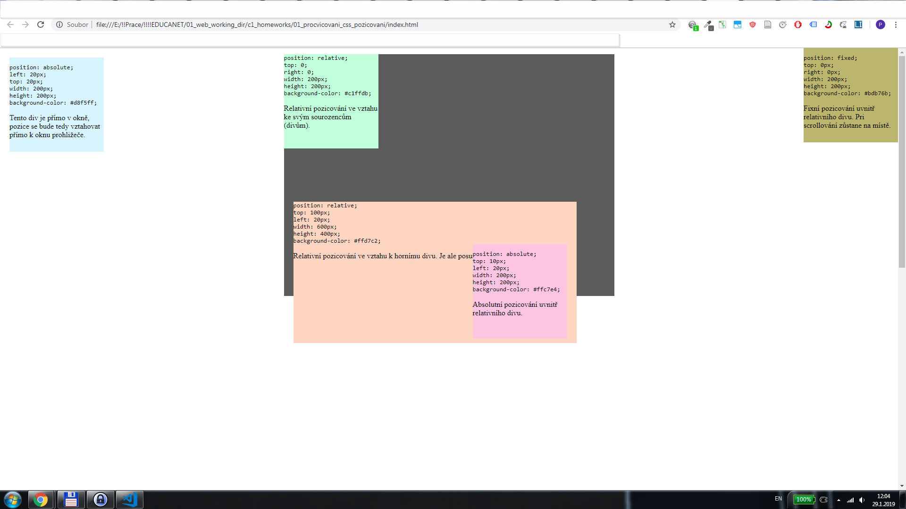

# Pozicovaní CSS

## :exclamation::exclamation: Zadání :exclamation::exclamation:
**Vytvořte stránku podle screenshotu**

Stránka obsahuje různé typy pozicování. Absolute, relative i fixed. U každého boxu je uvedeno, jaký typ pozicování použít a další vlastnosti, které daný div má. **Neupravujte index.html**

## Bonus "#hohashtag" :fire: :muscle: :thumbsup: 
Při vašem řešení nepoužijete ani jeden id selektor (:hash:). Upravte style.css i index.html tak, aby všechno stylování bylo jen pomocí tag selektoru a class selektoru. Nástin řešení je ve style.css:
 ```css
 .absolute {
    position: absolute;
}

.relative {
    position: relative;
}

.fixed {
    position: fixed;
}
 ```

## Screenshot :tv:


